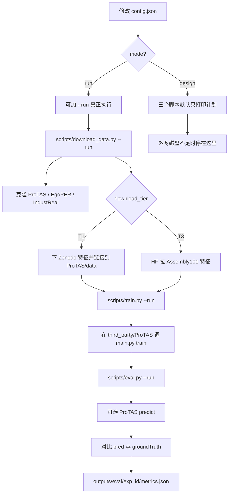

# 项目流程图

## 目录角色

| 路径 | 作用 |
|------|------|
| `config.json` | 唯一常改参数 |
| `scripts/download_data.py` | 下载模块 |
| `scripts/train.py` | 训练模块 |
| `scripts/eval.py` | 评测模块 |
| `third_party/` | 上游代码（脚本自动克隆） |
| `data/` | 特征/公开数据（不入库） |
| `outputs/` | 评测结果（不入库） |
| `docs/` | 设计与说明 |
